# ProEngine Labs: Pipeline Workflow Diagram

The following Mermaid diagram traces the entire end-to-end execution of the 22-agent LangGraph drug discovery pipeline. It follows a mutation query sequence from ingestion through molecular dynamics and final report assembly.

```mermaid
graph TD
    %% Styling Definitions
    classDef user input fill:#fcd34d,stroke:#b45309,stroke-width:2px,color:#000
    classDef trigger fill:#1d4ed8,stroke:#1e3a8a,stroke-width:2px,color:#fff
    classDef stage1 fill:#dcfce7,stroke:#166534,stroke-width:2px,color:#000
    classDef stage2 fill:#fef08a,stroke:#a16207,stroke-width:2px,color:#000
    classDef stage3 fill:#fed7aa,stroke:#c2410c,stroke-width:2px,color:#000
    classDef stage4 fill:#fecaca,stroke:#b91c1c,stroke-width:2px,color:#000
    classDef stage5 fill:#e9d5ff,stroke:#7e22ce,stroke-width:2px,color:#000
    classDef database fill:#cbd5e1,stroke:#334155,stroke-width:2px,color:#000
    classDef cache fill:#e2e8f0,stroke:#64748b,stroke-width:2px,stroke-dasharray: 4 4,color:#000
    
    %% Main Input
    QueryStart(["User Input (e.g. 'EGFR T790M')"]):::user --> NextJsAPI[Next.js Frontend POST /api/analysis]:::trigger
    NextJsAPI --> FastAPI[FastAPI Backend LangGraph Init]:::trigger
    
    %% Stage 1: Data Acquisition
    subgraph Stage1 ["Stage 1: Data Acquisition (Agents 1-6)"]
        Parser[1. MutationParserAgent<br/>Parses Gene & Variant]:::stage1
        Planner[2. PlannerAgent<br/>Creates Parallel Query Plan]:::stage1
        
        FetchNCBI[3. FetchAgent: PubMed<br/>Literature & Papers]:::stage1
        FetchUni[4. FetchAgent: UniProt<br/>Sequences]:::stage1
        FetchPDB[5. FetchAgent: RCSB<br/>PDB Structures]:::stage1
        FetchPub[6. FetchAgent: PubChem<br/>Known Baseline Inhibitors]:::stage1
    end
    
    FastAPI --> Parser
    Parser --> Planner
    Planner -. "Parallel Execution" .-> FetchNCBI & FetchUni & FetchPDB & FetchPub
    
    %% Stage 2: Structure & Variant Analysis
    subgraph Stage2 ["Stage 2: Structure & Variant Analysis (Agents 7-9)"]
        StructPrep[7. StructurePrepAgent<br/>Process PDB or Call ESMFold]:::stage2
        VariantEff[8. VariantEffectAgent<br/>ESM-1v Masked Pathogenicity]:::stage2
        PocketDet[9. PocketDetectionAgent<br/>fpocket detection & pocket_delta]:::stage2
        
        ESMCache[(ESMFold Cache)]:::cache
    end
    
    FetchNCBI & FetchUni & FetchPDB & FetchPub --> StructPrep
    StructPrep <--> ESMCache
    StructPrep --> VariantEff
    VariantEff --> PocketDet
    
    %% Stage 3: Molecule Design & Docking
    subgraph Stage3 ["Stage 3: Molecule Design & Docking (Agents 10-14)"]
        MolGen[10. MoleculeGenerationAgent<br/>RDKit / Pocket2Mol 3D Diffusion]:::stage3
        Docking[11. DockingAgent<br/>Vina Pose Search + Gnina CNN]:::stage3
        Selectivity[12. SelectivityAgent<br/>Dual-Dock Target vs 10 Off-Targets]:::stage3
        ADMET[13. ADMETAgent<br/>PAINS, Lipinski, Tolerability]:::stage3
        Optimization[14. LeadOptimizationAgent<br/>Bioisostere Replacements]:::stage3
    end
    
    PocketDet --> MolGen
    MolGen --> Docking
    Docking --> Selectivity
    Selectivity -- "Filter >3.2x selective" --> ADMET
    ADMET -- "Keep passing >=8/10" --> Optimization
    Optimization -- "Rank 30 Leading Analogs" --> GNNAff
    
    %% Stage 4: Ranking & Validation
    subgraph Stage4 ["Stage 4: Validation & Refining (Agents 15-17)"]
        GNNAff[15. GNNAffinityAgent<br/>DimeNet++ Filter Top 30 ---> Top 2]:::stage4
        MDVal[16. MDValidationAgent<br/>50ns OpenMM RMSD Stability]:::stage4
        Resistance[17. ResistanceAgent<br/>LLM Escape Mutation Forecast]:::stage4
    end
    
    GNNAff -- "Exact 2 molecules" --> MDVal
    MDVal --> Resistance
    
    %% Stage 5: Context Analysis
    subgraph Stage5 ["Stage 5: Contextual Embedding (Agents 18-20)"]
        SimSearch[18. SimilaritySearchAgent<br/>Tanimoto Index Check]:::stage5
        Synergy[19. SynergyAgent<br/>Combinatorial Targets]:::stage5
        Clinical[20. ClinicalTrialAgent<br/>Live ClinicalTrials.gov Search]:::stage5
    end
    
    Resistance --> SimSearch & Synergy & Clinical
    
    %% Stage 6: Output
    subgraph Stage6 ["Stage 6: Output & Assembly (Agents 21-22)"]
        Synth[21. SynthesisAgent<br/>ASKCOS Retrosynthesis SA Scores]:::stage5
        Report[22. ReportAgent<br/>Assembles JSON graphs & limits ranks]:::stage5
    end
    
    SimSearch & Synergy & Clinical --> Synth
    Synth --> Report
    
    %% Terminal Actions
    NeonDB[(Neon PostgreSQL<br/>Saves Run into Discoveries)]:::database
    Report --> NeonDB
    Report -- "Yield Final JSON" --> ClientStream
    
    %% Client SSE
    ClientStream([SSE Stream Event Queue]):::trigger --> UI[Next.js Interactive Dashboard UI]:::user

```

### Stage Summary

- **Stage 1 (Ingestion & Search):** Accepts a natural language trigger, isolates the mutation pattern, and aggressively fetches available public biological data utilizing parallel requests. 
- **Stage 2 (Structure Assembly):** Retrieves cached or freshly minted 3-Dimensional models of the protein and mathematically zeroes-in on geometrical mutations within the binding pocket.
- **Stage 3 (Core Docking Filter):** Rapidly iterates across millions of theoretical molecules to dock and apply aggressive biochemical constraints. This is where dual-docking eliminates poor fits.
- **Stage 4 (Empirical Physics):** Funnels surviving candidates into strict physics engines. It reduces candidates down to **only two**, solving the OpenMM GPU computation bottleneck via DimeNet++ filtering prior to entry.
- **Stage 5 (Application Readiness):** Connects winning leads to the real world—identifying clinical precedent and assessing how to safely augment them in synergy.
- **Stage 6 (Completion):** Derives synthesis viability pathways before constructing the comprehensive JSON result payload, saving it asynchronously to the database while streaming is consumed by React.
